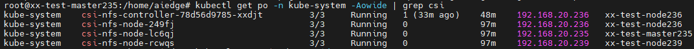
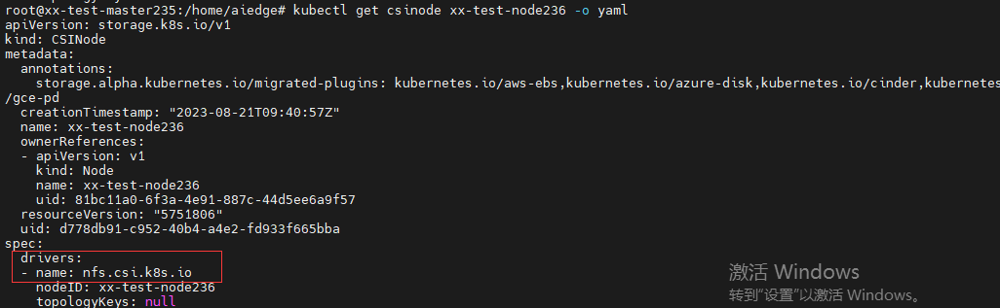
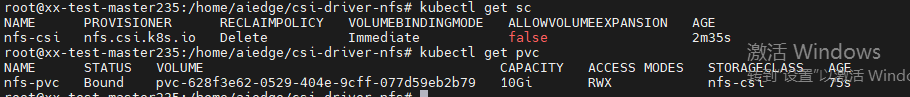
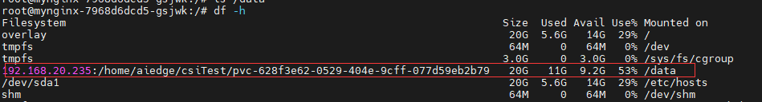
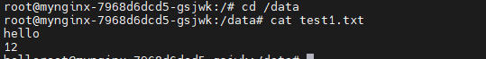

# csi-nfs
## 步骤

### 第一步：NFS服务器配置【可在集群外】

要在机器192.168.20.235上配置 NFS 服务器端并共享目录`/home/aiedge/csiTest`，需要执行以下步骤：

1. **安装 NFS 服务器软件：**
   使用以下命令安装 NFS 服务器：

   ```bash
   sudo apt-get update
   sudo apt-get install nfs-kernel-server
   ```

2. **配置 NFS 服务器：**
   打开 NFS 服务器的配置文件，通常为 `/etc/exports`：`sudo nano /etc/exports`

   在文件的末尾添加以下行，以共享`/home/aiedge/csiTest`目录：

   ```bash
   /home/aiedge/csiTest *(rw,sync,no_root_squash)
   ```

   **这个配置允许所有主机（`*`）以读写（`rw`）的方式访问共享目录。**

   > 内容通常为：
   >
   > ```txt
   > directory machine1(option11,option12)
   > ```
   >
   > - **directory**
   >
   >   要共享的目录。如 /home/aiedge/csiTest
   >
   > - **machine1**
   >
   >   nfs客户端，就是哪些机器可以访问他，可以是指定ip，也可以是一个ip段。
   >
   >   ```txt
   >   /data 172.18.11.0/24(rw)
   >   ```
   >
   >   ```txt
   >   /data 172.18.11.1(rw) 172.18.11.2(rw)
   >   ```
   >
   > 
   >
   > - **option** 重要的权限有如下几种：
   >
   >   - ro : 只读，不可写
   >
   >   - rw：有读写权限
   >
   >   - no_root_squash/root_squash：默认情况下(all_squash)，客户端上的root用户发出的任何请求都会变成服务端的**nobody用户权限**去执行。如果开启了此项`no_root_squash`，**客户端上的root用户发出的请求等同服务端的root用户权限**，会有安全隐患，不建议使用 no_root_squash
   >
   >     ("nfsnobody" 是一个特殊的用户和组，通常用于映射在NFS服务器上没有对应用户或组的客户端请求。)
   >
   >   - async/sync： 默认情况下，所有exportfs命令都将使用**异步**，即使用sync选项文件先保存在内存中，达到触发条件再发往服务端，性能较好，但存在风险。若使用同步async，则实时存到服务端。
   >
   >   **基于安全的最佳配置**：
   >
   >   https://blog.csdn.net/yangshihuz/article/details/104783585
   >
   >   ```bash
   >   # 创建文件共享目录和文件夹权限
   >   mkdir /nfs_share
   >   chown nobody:nogroup /nfs_share/
   >   chmod 750 /nfs_share/
   >   
   >   #配置文件
   >   vi /etc/exports
   >   
   >   /nfs_share 192.168.20.236(rw,all_squash,sync) 
   >   #客户端所有用户在访问服务端都会以nobody用户访问，因此可以读写
   >   
   >   #配置文件生效
   >   exportfs -rav 
   >   
   >   #在192.168.20.236端mount
   >   sudo mount -t nfs 
   >   #查看
   >   192.168.20.235:/nfs_share /home/aiedge/mnt
   >   aiedge@xx-test-node236:~$ ll /home/aiedge/mnt
   >   total 8
   >   drwxr-x---  2 nobody nogroup 4096 Dec 20 15:01 ./
   >   drwxr-xr-x 12 aiedge aiedge  4096 Dec 19 14:48 ../
   >   
   >   ```
   >
   > 


3. **重启 NFS 服务：**
   完成配置后，重启 NFS 服务以使更改生效：

   ```bash
   sudo systemctl restart nfs-kernel-server   # 对于基于 systemd 的系统
   ```

4. **验证共享配置：**
   使用以下命令验证 NFS 服务器是否正在运行并已正确配置：

   ```bash
   sudo systemctl status nfs-kernel-server   # 检查服务状态
   showmount -e 192.168.20.235               # 显示可用的 NFS 共享
   ```

   如果一切设置正确，应该能够看到输出，表明`/home/aiedge/csiTest`目录已经共享出去了。

现在，你已经在192.168.20.235机器上配置好了 NFS 服务器端，并共享了`/home/aiedge/csiTest`目录。其他主机可以使用 NFS 客户端挂载这个共享目录。

```bash
root@xx-test-node239:/home/aiedge# sudo mkdir -p /mnt/nfs
root@xx-test-node239:/home/aiedge# sudo mount -t nfs 192.168.20.235:/home/aiedge/csiTest /mnt/nfs

```

### 第二步：配置CSI

安装nfs-csi-driver

这个插件驱动本身只提供了集群中的资源和NFS服务器之间的通信层，使用这个驱动之前需要 Kubernetes 集群 1.14 或更高版本和预先存在的 NFS 服务器。

```bash
git clone https://github.com/kubernetes-csi/csi-driver-nfs.git
cd csi-driver-nfs
./deploy/install-driver.sh v4.1.0 local #表示用本地yaml部署
```

镜像问题
所需要的镜像：
1. "registry.k8s.io/sig-storage/csi-provisioner:v3.2.0"
2. "registry.k8s.io/sig-storage/csi-node-driver-registrar:v2.5.1"
3. "registry.k8s.io/sig-storage/nfsplugin:v4.1.0"
4. "registry.k8s.io/sig-storage/livenessprobe:v2.7.0"
解决：`ctr -n k8s.io image import /home/aiedge/csi_images.tar`【251节点上】

查看
`kubectl get po -Aowide | grep csi`
出现以下pod且running则此步成功
```bash
csi-nfs-controller-78d56d9785-nnbcc    csi-nfs-node-249fj                     csi-nfs-node-lc6qj                     csi-nfs-node-rcwqs                     
```



查看csinode信息：



> csi驱动的名称：nfs.csi.k8s.io

====
此时nfs部署成功，以下是使用：

### 第三步：创建sc与pvc

关于nfs-driver的参数：https://github.com/kubernetes-csi/csi-driver-nfs/blob/master/docs/driver-parameters.md

#### 静态创建PV【项目使用的方法】

如果不使用SC，使用静态方式制备

```YAML
---
apiVersion: v1
kind: PersistentVolume
metadata:
  name: pv-nfs-static
spec:
  capacity:
    storage: 10Gi
  accessModes:
    - ReadWriteMany
  csi:
    driver: nfs.csi.k8s.io
    readOnly: false
    volumeHandle: unique-volumeid  # #确保它是集群中的唯一 ID
    volumeAttributes:
      server: 192.168.20.235
      share: /home/aiedge/csiTest/
---
apiVersion: v1
kind: PersistentVolumeClaim
metadata:
  name: nfs-pvc-static
spec:
  accessModes:
    - ReadWriteMany
  resources:
    requests:
      storage: 10Gi
  storageClassName: "" # 此处须显式设置空字符串，否则会被设置为默认的 StorageClass
  volumeName: pv-nfs-static
# 控制平面可以在集群中将 PersistentVolumeClaims 绑定到匹配的 PersistentVolumes。 但是，如果你希望 PVC 绑定到特定 PV，则需要预先绑定它们。
```

> 通过在 PersistentVolumeClaim 中指定 PersistentVolume，你可以声明该特定 PV 与 PVC 之间的绑定关系。如果该 PersistentVolume 存在且未被通过其 `claimRef` 字段预留给 PersistentVolumeClaim，则该 PersistentVolume 会和该 PersistentVolumeClaim 绑定到一起。
>
> 绑定操作不会考虑某些卷匹配条件是否满足，包括节点亲和性等等。 控制面仍然会检查[存储类](https://kubernetes.io/zh-cn/docs/concepts/storage/storage-classes/)、 访问模式和所请求的存储尺寸都是合法的。

#### 动态创建PV

使用这个 StorageClass 来创建 PersistentVolumeClaim（PVC）

```yaml
apiVersion: storage.k8s.io/v1
kind: StorageClass
metadata:
  name: nfs-csi
provisioner: nfs.csi.k8s.io
parameters:
  server: 192.168.20.235
  share: /home/aiedge/csiTest
reclaimPolicy: Delete
volumeBindingMode: Immediate
---
apiVersion: v1
kind: PersistentVolumeClaim
metadata:
  name: nfs-pvc
spec:
  accessModes:
    - ReadWriteMany
  resources:
    requests:
      storage: 10Gi
  storageClassName: nfs-csi

```



### 第四步：可以开始使用PVC

```yaml
apiVersion: apps/v1
kind: Deployment
metadata:
  name: mynginx
  labels:
    app: mynginx
spec:
  replicas: 1
  template:
    metadata:
      name: mynginx
      labels:
        app: mynginx
    spec:
      containers:
        - name: mynginx
          image: nginx
          imagePullPolicy: IfNotPresent
          volumeMounts:
            - mountPath: "/data"
              name: data
      restartPolicy: Always
      volumes:
        - name: data
          persistentVolumeClaim:
            claimName: nfs-pvc
  selector:
    matchLabels:
      app: mynginx

```

进入Pod查看

```bash
 kubectl exec -it mynginx-7968d6dcd5-gsjwk -- /bin/bash
 #查看挂载情况
 df -h
```



在NFS 服务器上`/home/aiedge/csiTest/pvc-628f3e62-0529-404e-9cff-077d59eb2b79/`新增文件test1.txt

在pod中查看：



## 删除：

**clean up NFS CSI driver**

```bash
./deploy/uninstall-driver.sh v4.1.0  local
```

